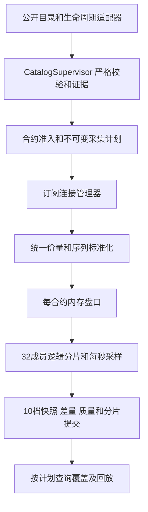

# ARB-0009 期权新挂牌发现和到期退出设计

日期：2026-10-04。版本：R5。状态：已部署，首次持续运行故障已另行修订并部署。本文修正[R4](arb-0009-options-collection-design.md)中一次启动固定选约、到期后不能接续采集的问题，并定义新挂牌期权自动纳入的实现方案。初次实现与已测限制见[实施记录](arb-0009-options-lifecycle-implementation.md)，初次审核见[0018](../../../discuss/0018-options-lifecycle-design-review.md)；最新修订及验证见[持续运行修复](arb-0009-options-sustained-repair.md)与[0019复审](../../../discuss/0019-options-lifecycle-sustained-review.md)。

## 1. 目标和范围

`OPTIONS_SYMBOLS=auto` 改为持续发现并采集四个已支持合约族的全部未到期期权：BTC、ETH 币本位和 BTC、ETH USDC 线性。包括新增到期日和新增行权价，不再使用2–45天、平值附近三个行权价、C/P配齐或同到期期货配齐作为采集准入条件。支持范围内的交割期货独立采集，分析端再进行配对。永续、其他资产和combo仍有明确的排除记录。

单个期权只要经济身份、整数价量单位和规则可验证，就可订阅。真实空书或缺少分析配对腿不能阻止采集。挂牌但尚未开放的合约先进入待开放状态；开放时立即调度订阅。显式 `OPTIONS_SYMBOLS` 继续表示用户指定范围，不能擅自扩成全链；R4的历史run及其校验规则保留。

“开始抓”指发现并校验后立即请求订阅、接收快照和后续更新。可回放历史从已提交计划的完整UTC分钟开始。实现默认在当前分钟后第二个边界生效，为证据落盘和订阅预热留出1–2分钟，未来计划队列有界。不能把挂牌时间、订阅ACK或索引更新当作有效盘口起点。

## 2. 已确认的根因

`Discover` 只在 `Prepare` 时选约；`refreshMetadata` 只更新已有 `p.Specs`。`engine.sample` 到期后写关闭原因，但不会结束 `Collect`。因此 `Run` 不会重新进入 `Prepare`，指数和质量记录继续写入，实际有效期权盘口却可以一直为零。

2026-10-03检查的运行 `d0d26782-21b7-4e1e-9e05-ce3b6aa20c32` 有24个期权和4个期货，全部于当日08:00 UTC到期。到期后最新分钟没有有效盘口锚点，四个指数仍写入。证据保存在[采集健康检查](../../../research/2026-10-03-all-collectors-health/report.txt)。

只在到期时重启整个collector不能满足新增行权价自动采集；只把固定run从32改大也不能解决身份、成员变更和连接控制请求的容量限制。

## 3. 发现合约和补漏

新增 CatalogSupervisor，独立于盘口连接和单轮采集。启动顺序为：先接收生命周期订阅，再获取六个目录scope（BTC、ETH、USDC × option、future），最后合并目录和连接期间接纳的事件。这样启动目录请求期间的新挂牌不会落在两个步骤之间。

监听六个 `instrument.creation.<kind>.<currency>`、六个 `instrument.state.<kind>.<currency>` 和 `platform_state`。creation携带完整定义，state只携带身份和状态，不能用state消息猜合约单位。创建事件可直接严格解析；字段不足时调用 `public/get_instrument` 单独确认，仍未确认则保留待确认，不写有效盘口。[创建频道](https://docs.deribit.com/subscriptions/market-data/instrumentcreationkindcurrency)、[状态频道](https://docs.deribit.com/subscriptions/market-data/instrumentstatekindcurrency)、[单合约接口](https://docs.deribit.com/api-reference/market-data/public-get_instrument)。

目录在启动、生命周期连接重连及每30分钟核对一次；每个scope独立成功或失败。重连立即核对，不等待例行周期。发现scope不完整或响应解析失败时，受影响scope一分钟后重试，沿用身份但不刷新当前规则或市场状态。正常状态不按合约逐个轮询。`get_instruments` 可能有约一分钟缓存，新事件不能因为目录暂时查不到就被删除；已存在的成员目录遗漏要单独确认。[目录接口](https://docs.deribit.com/api-reference/market-data/public-get_instruments)、[官方采集建议](https://docs.deribit.com/articles/options-data-collection-best-practices)。

所有发现按native ID、symbol和经济定义hash去重。未知身份事件合并成有界待确认任务，重试5秒、15秒、60秒，之后每分钟继续，受共享限流和cooldown约束；排队等待会计入发现延迟。目录/creation中明确不支持的资产或combo记排除原因。未知协议字段、状态或单位不能作为“无关合约”静默过滤。

完整scope仅在整份响应严格解析、身份唯一、accepted与excluded总数等于原始数量时成立。一次scope失败不阻止其他成功scope的新合约启动，也不伪造失败scope的当前清单。

低频目录和生命周期原始响应以payload hash为名压缩归档，原始字节先原子落盘，再写定类型观测；来源URL/频道、请求时间、采集时间、来源时间及hash保留。重试复用同一观测身份及内容。网络错误没有响应时hash可空，必须明确失败，不能发布成功事实。高频盘口不追加JSON日志。

归档和DB写入均在有界后台队列完成，不能阻塞源消息reader或负向失效。接纳到locked/halted/settlement/maintenance、未知状态或协议错误时，先向受影响书的有序入口投递保守失效，在接纳后的首个采样边界生效；不等待证据持久化。证据尚未持久化时质量引用NULL、状态未知、原因MetadataUncertain，不能声称有已发布关闭事实。正向open/恢复只能在定义、规则、状态及平台证据都落盘后发布。归档/写入队列超限即停止相应来源的正向发布，失效已有状态并报告故障；未落盘证据不得出现在commit引用中。

## 4. 合约状态和规则

采用独立状态：待确认、待开放、待容量、订阅中、等待快照、采集中、暂停、已到期、已退市。采集状态和交易所状态分开；已订阅不等于可回放，盘口静默也不等于到期。

| 来源状态或条件 | 处理 |
| --- | --- |
| 已验证、未到期、open | 立即申请订阅；按ACK、快照、序列及规则条件确定有效性 |
| 已创建但尚未开放 | 保存定义及状态，等待open，不要求C/P或期货齐全 |
| settlement、locked、halted | 立即停止发布可交易/有效盘口，保留身份；不能当作永久退市 |
| 再次open | 同一经济身份恢复订阅并获取新快照；不能沿用暂停前的书 |
| 本地UTC时间达到expiration_timestamp | 无需等待REST或推送，立即标到期；退出订阅并保留历史 |
| delivered、archivized | 保存终止证据，退出订阅；不等待进程重启 |
| inactive、closed、目录遗漏 | 保守停止有效性，单独确认；不因一份目录遗漏永久删除 |
| definition hash改变 | 旧身份停止有效性，新版本重新注册和订阅，历史不覆盖 |
| lifecycle断线、未知状态、冲突或超时 | 状态标未知；重新核对目录和平台状态后恢复，不生成看似有效的书 |

`is_active` 仅表示书可见，不能等同于open。货币/指数整体锁定不一定有单合约state推送，必须处理 `platform_state` 的maintenance和price_index锁定。[状态语义](https://docs.deribit.com/api-reference/market-data/public-get_instrument)、[平台频道](https://docs.deribit.com/subscriptions/platform/platform_state)。

生命周期消息的来源时间与有序入口接纳时间都保存。只从接纳后的采样边界生效，不回写历史秒。重复事件幂等；旧epoch和比已接受状态更旧的来源时间不能恢复开放。同一来源时间冲突、目录和事件冲突或无可证明的先后关系时标未知，并发起确认。规则与市场状态分别引用证据，不能把state消息当作新的tick/min amount规则。

启动或生命周期重连后，先确认 `platform_state` 订阅ACK，再在同一epoch调用 `public/status` 建立锁定基线，保存请求/响应接纳顺序和原始证据。`locked` 严格接受官方字符串 `true`、`partial`、`false`；true阻止全部市场有效性，partial必须有严格有效的 `locked_indices` 列表，缺列表或未知值使全部锁定状态未知，false证明当前未锁定。查询在途发生状态通知时，不用无来源时间的响应覆盖该通知；重新查询确认。每次epoch改变均重新建立基线，期间只接收原始书，不发布有效盘口。[公共状态接口](https://docs.deribit.com/api-reference/supporting/public-status)。

`public/status` 没有maintenance字段，不能推导 `maintenance=false`。maintenance独立为unknown/true/false；收到true立即暂停，收到false仍需新锁定基线及新快照才能恢复。初始maintenance=unknown允许在已确认未锁定、单合约open、生命周期连接健康且书连续的条件下采集，质量证据保留unknown，不宣称确认了“没有维护”。这样不会因源没有提供维护初始快照而永久阻止全部采集。任何已知maintenance=true或未知锁定状态都不能通过这条初始规则放行。

已验证规则持续使用至新规则被知悉或确认失效，但生命周期连接失去确认超过30秒、目录核对超过35分钟没有成功或出现失败证据时，相关市场状态不能继续声称当前已知。恢复后需取得新快照，适配器不能只清除质量原因而复用失效期间的书。

## 5. 采集分层和连接容量

保留每逻辑分片最多32成员，复用已有32成员缓冲和有界分钟队列。逻辑分片与物理WebSocket连接分开：一个物理连接可服务多个逻辑分片；四个指数共享一条来源连接，再发布到分片有序入口。目录和规则由Supervisor统一刷新，不能每个分片重复请求六份完整目录。

新增合约分配给空闲逻辑分片或新分片，已有活跃分片不因新增合约重连。物理连接管理器支持带独立request ID的增量subscribe/unsubscribe，逐请求校验ACK列表；订阅ACK前收到的书可以缓冲，但不能提前有效。每合约有订阅代次，取消后旧消息不能污染下一代。断序或解析错误只使受影响的书无效并重新快照，连接断开则使该连接所有书无效。恢复不能同时无节制请求。

book通知没有本地request ID或代次，因此代次隔离要由协议栅栏实现，不能直接把到达消息标为“当前代次”。同连接单reader给每帧分配单调接纳序号；取消时停止旧channel路由，确认unsubscribe ACK并排空旧代次Ingress，再发新subscribe；新代次仅在ACK和full snapshot均满足后有效。若源协议不能证明ACK之后不会到达旧书，或经济定义改变，则将受影响channel迁入新物理epoch的恢复连接，重新确认定义及完整快照；不能凭同symbol的snapshot认定新经济身份。恢复连接也计入总容量，不重连其他正常channel。首次追加从未订阅的channel不需要等待旧代次取消。

32是项目逻辑批次上限，不是已验证的交易所频道限制。每连接频道数、总连接数、活跃合约数、深度内存、总Ingress字节、控制请求、磁盘写入及查询预算都必须配置且实测。不能把全部合约简单拆成32成员各自两条连接：现有全局一秒ControlGate会让大量heartbeat test请求排队，导致健康连接被超时重置。

2026-10-03 16:23 UTC的公共目录初筛得到3062个四族open未到期期权和44个交割期货；这是按资产、状态和到期筛出的数量，正式准入还必须经过严格规范化。若每32成员各用书和指数两条连接，约98个逻辑分片就需要196条连接。[完整公开响应及hash](../../../research/2026-10-04-options-lifecycle-design/public-catalog-summary.json)说明共享物理连接不是可选优化。

连接管理器设独立订阅间隔与统一公共请求信用预算，优先保留心跳响应/取消请求，429和10028共享cooldown；严格遵守源端当前限流。具体连接频道数和默认全链预算由启动目录数量及压力测试确定，不能声称“全量可用”而只提高常量。[订阅协议](https://docs.deribit.com/api-reference/subscription-management/public-subscribe)。

容量不足时新增合约进入 `capacity_blocked` 并持续重试，既有采集保持运行。状态页必须红色显示覆盖缺口，不能把待容量计为已采集或悄悄截成前32个。实现验收要求本机预算容纳当时四族完整目录，以及至少20%新增余量；若不满足，交付应明确未达到全量目标。

## 6. 分钟成员变更和到期

`LiveRun` 仍代表固定成员的不可变逻辑分片。新增 `catalog_v2` 选择类型，单个已验证option或delivery就可组成分片；旧explicit/near_atm_v1的配对校验保留。新的采集计划定义每UTC分钟所有应采集合约及唯一所属run；不能改写已经发布的run成员数组。

新挂牌的身份及证据持久化后即可预订阅接收书。新run从计划的完整UTC分钟参与存储，默认边界为当前分钟后第二个边界。未准备好也生成质量记录，不能等到有好书才把它加入应采集合约清单。

已有逻辑分片需要增删成员时，仅为该分片创建新run并发布计划：

1. 先注册定义、规则和状态证据，写不可变新run。
2. 再写完整计划行，指定生效的UTC分钟T；只有写入成功才能切换。
3. 原run写到T前一分钟结束；新run自T第0秒开始。未变合约可继承经过连续性校验的内存书；每个新分钟都重新生成完整10档锚点。
4. 新成员若T第0秒还没取得有效快照，该分钟保留缺锚点质量，首次可回放从下一完整分钟开始。不回填第0秒。

每个 `(instrument_id, minute_time)` 在实时计划内最多一个owner run。T时先停止旧run生产T及之后的样本，立即把采样所有权交给新run；旧run只可在后台排空T之前已冻结的分钟，不能用45秒排空等待阻塞新run的T第0秒锚点。writer逐批校验该分钟的计划归属；旧队列即使晚写也不能提交T及之后的数据。T之前排空失败形成明确历史缺失，不影响T之后的新run。仅针对同一run同一分钟的重复writer或进程重启，才要求旧writer完全退出。若计划来不及持久化并在有序入口发布，推迟到之后的分钟；无计划不能写有效实时提交。

计划属于数据库内同一采集链，除了session内revision，还有全局 `previous_plan_id/hash` 和严格递增的 `effective_minute`。一个计划覆盖 `[effective_minute, successor.effective_minute)`；首计划无前驱，之后必须连接数据库当前尾部，不能分叉。每个分钟只接受最后一份生效计划；已发布计划不能修改、撤回或用新session覆盖同一分钟。T已发布后再发现合约，立即预订阅，但计划生效放到下一分钟，不能追加第二个T计划。重启继承全局尾部，创建新session的后继计划；最后提交数据保留原计划归属，停机到新计划间如实显示缺失。计划尾部读写与发布由单进程计划锁串行，启动持有进程级独占锁，第二writer直接拒绝启动。

到期发生在分钟内时，该秒起失效，分钟其余秒保存关闭原因，保留先前有效数据。尽快取消源订阅；分钟完结后在下一计划删除到期成员。整个分片到期则结束该分片，但Supervisor和其他分片继续工作，不能进入“无盘口仍正常”的无限循环。到期与新合约上市彼此独立，新合约可在旧合约到期前就被采集。

临时暂停合约仍列为应采成员并保存质量，不永久退出范围。明确到期/终止的合约从下个分钟的计划退出，历史定义和数据不删除。物理连接重连仅重订阅当前有效成员，不能带已到期symbol使整批ACK失败。

## 7. 定类型模型和历史兼容

复用现有六张derivative事实表、`options_live_run`、`options_index_minute`和旧元数据表。R5新增以下专项表；以下表已实现并在隔离库验证，生产尚未迁移。实际字段和DDL以存储字典10.4为准。

| 新表与逻辑键 | 必备字段和不变量 |
| --- | --- |
| `options_catalog_scope_observation`，`(observation_id, scope)` | scope、请求/观测时间、来源URL、payload hash、成功/错误状态、raw/accepted/excluded数量；等长native ID、symbol、注册ID、定义hash、规则ID、状态/active及排除原因数组。完整性按scope证明；无响应失败不能填成功计数 |
| `options_lifecycle_observation`，`observation_id` | 来源频道/URL、连接epoch、接纳序号、来源时间/采集时间、hash、native身份或待确认symbol、target类型instrument/index/platform、状态、平台锁定模式true/partial/false/unknown及locked_indices数组、Nullable单指数锁定/maintenance、校验状态。未知字段保存失败证据，不能伪造open |
| `options_collection_plan`，`(session_id, revision)` | 不可变plan ID/hash、previous plan ID/hash、配置hash、创建时间、生效分钟；完整应采instrument/定义hash/owner run等长数组、所引用scope/生命周期证据、有类型的pending身份/原因及排除身份/原因；session内revision及跨session生效分钟均严格递增，禁止分叉和同分钟覆盖 |
| `options_catalog_quality_evidence_minute`，`(run_id, instrument_id, minute_time, batch_id)` | 60槽状态证据ID、规则/目录证据ID、平台基线证据ID及行hash；缺未知证据用NULL，不借前一个run的状态当本run的新确认 |
| `options_catalog_live_minute_commit`，`(run_id, minute_time)` | plan ID/hash、run hash、batch ID、prepared_at、完整member ID/hash、质量证据摘要、指数摘要、锚点及差量数。先写全部事实与证据，再发布；查询校验计划owner及全部摘要 |

目录scope观测的排除项不要求注册为可采instrument；pending未知身份同样不得分配猜测的经济身份。生命周期原始字节归档与表内定类型摘要关联，归档不是通用JSON数据库表。

`LiveRun` 的原有JSON字段和Hash编码不修改，新增selection值不改变任何旧run的序列化。不能直接给旧结构添加零值字段后重算历史hash。旧分钟commit、质量hash和回放仍走R4校验；catalog_v2使用独立writer/loader与 `deribit-catalog-live-minute-v2` 摘要域，摘要涵盖计划、事实、60槽证据及准备时间。

质量仍使用现有理由编码，市场状态依据1表示有生命周期接纳证据，2表示目录证据，0表示未知。R5验证器分别核验规则知悉时间、状态接纳时间、平台状态及源epoch；不再套用R4“状态发布时间必须等于规则发布时间”的假设。原有分钟事实的编码和数值语义不变。

指数来源连接共享，本版允许同一指数随多个逻辑分片保存分钟副本，保持run内完整性；不会把这些副本当作独立来源或相加。空间成本须单独测量。其他来源旧10档、旧50档及混合历史不迁移或重写。

全量分钟查询以该分钟生效计划为范围，分别读其应有分片commit。单一分片失败不隐藏其他已提交分片；全量覆盖必须返回missing/incomplete分片及受影响成员。不能以最大 `StartedAt` 的一个run代表全链，也不能把最新已提交分钟当作所有分片同一时点的状态。

## 8. 重试和恢复

同一个准备完的分钟在重试中复用batch ID、PreparedAt及全部内容；部分事实写入但没有commit时对查询不可见。每个新run/计划的写入确认不明时，先按ID读回比对，不分配新ID或开始重复采集。

进程重启后以已发布计划和commit恢复所有权与历史范围，内存书全部重新快照，从新计划的完整UTC分钟采样。不能把数据库最后10档当成源端L2快照，也不补写停机时段为有效。新进程启动前旧writer必须退出，保持本机单writer约束；session用于区分进程，但不能允许两个session同时写当前合约。

分片写入超时或Ingress溢出只停止受影响分片并发布故障，不能重启CEX、收益、DEX或其他期权分片。R5 writer不复用现有贯穿网络重试的全局 `derivativeMu`：采用 `(run_id,minute_time)` 内容冲突锁、可取消的公平有界DB并发预算，以及独立的目录/规则写入额度。定义注册仍串行保证instrument ID稳定，但该锁不覆盖盘口分钟写入；规则和证据按确定身份批量幂等写入，不能持有全局盘口锁。计划先引用已确认的定义/规则/证据，不通过放松校验避免等待。

单分片请求卡住不能占满全部DB槽位；公平调度须给其他分片及控制事实保留机会。共享数据库整体不可用会使多个分片分别失败并显示共同来源故障，不能声称在DB停机时其他分片仍可提交。共享资源总预算超限时控制准入，不能靠无界队列把故障传给整个collector。基础时钟异常仍停止受影响采样、重新确认，不沿用错误时间。

## 9. 健康检查和验收

状态同时输出：每scope最后成功核对与连续失败、生命周期连接/平台基线新鲜度、已知可采总数、计划应采数、订阅确认数、取得快照数、待开放/待确认/待容量数量、当前有效和可回放书数、到期退出数、发现到订阅/快照/首次可回放的延迟。每分钟检查计划与commit覆盖，最新有效盘口时间单独显示。

四族目录中存在open合约但没有有效书、pending超时或catalog过旧时均报告异常。无变化且序列/连接/规则有效的空书仍是有效观测；不能以成交活跃度判故障。指标有数据时间，指数有更新或commit有增加不能掩盖盘口为零。

| 验证情形 | 必须通过的结果 |
| --- | --- |
| 新到期日、新行权价、仅一条C/P、没有同到期期货 | 独立纳入并订阅，不触发全任务重启，不删除旧成员 |
| creation先于目录缓存、启动期间创建、生命周期掉线期间上市 | 事件或重连核对补入；缓存遗漏不删除；严格确认失败保持pending |
| 到期边界、整批到期、分钟内到期、暂锁再open、平台整体锁定 | 到期秒后无有效书；旧历史保留；其他合约持续；恢复需快照；平台未知不假开放 |
| 部分scope失败、解析失败、身份冲突、未知状态 | 不伪造新规则/当前目录；成功scope独立启动；冲突可追溯 |
| ACK不完整、消息早于ACK、取消后旧epoch/旧channel延迟消息、断序 | 不产生伪有效秒；单reader栅栏及新epoch恢复验证；单合约和连接故障边界符合第5节 |
| 生命周期归档/DB故意阻塞、后台队列超限 | 负向事件接纳后仍先失效，不能继续open；正向等待落盘；NULL证据保持unknown，不发布伪事实 |
| T边界增删成员、计划写失败、旧writer排空失败、重启 | 每分钟唯一owner；无计划/未commit数据不可见；不复用旧书或伪造起点 |
| 事实或证据漏行、部分写失败、确认不明后重试 | 返回incomplete或未发布；内容/身份稳定；不能按无变化处理漏差量 |
| 活跃/静默盘口一日、混合R4/R5/旧50档 | 所有有效秒精确回放；同秒最终数量、qty=0删除、有效/无效位图、旧50档不截断都验证 |
| 当时完整四族目录，加20%成员、集中挂牌、全连接重连 | 内存/队列/控制请求受预算约束；心跳不饿死；CEX/其他来源采样不受明显影响；报告真实覆盖和容量缺口 |

建议验收目标：源已送达且定义完整、容量充足时，事件接纳至订阅请求P95不超过5秒；首次快照单独计量，不作为源端保证。漏事件的发现上界为重连核对或30分钟例行核对加源响应/限流等待。对于正常事件路径，首次可回放从计划指定的完整分钟开始；计入分钟写入时间，不宣称新挂牌后立即有完整历史。

容量验收要记录压缩后每日事实/质量/证据/指数副本占用、CPU/RSS、每秒采样耗时、Ingress峰值、控制请求延迟、单合约回放和全量分钟查询P50/P95。旧28合约的实测不能作为全链容量证明。

## 10. 实现顺序和部署边界

1. `internal/exchange/deribit`：creation/state/platform及单合约严格解码、原始证据、增量订阅ACK和公共请求调度；扩充locked/halted/archivized状态，保留未知状态失败语义。
2. `internal/options`：catalog_v2准入、不可变计划与证据模型、独立hash域；保持R4校验和序列化兼容。
3. `internal/optionslive`：Supervisor、连接管理、分钟所有权切换与自动到期退出；复用盘口、Ingress、10档采样和有限写入队列。
4. `internal/storage/clickhouse`：新表初始化、R5写入提交与查询校验；同步[存储字典](../../market-data-storage.md#104-期权自动发现模型r5)。
5. `cmd/options-check`和运行状态：默认查当前全量计划，`--run`保留单分片和旧历史查询；报告应采及缺失，增加只读health输出。
6. 完成上述确定性回归、真实公开协议验证及全链容量测量，构建并在现有部署中启用auto新语义。首次安装新binary可需要一次collector重启；此后挂牌、到期与故障恢复无需人工重启。

当前代码及线上仍是R4，本文不宣称已经恢复采集。实施时保留已存历史，在明确UTC分钟完成单writer交接；回退采用旧binary和配置时，状态必须提示恢复固定选约限制，不能报全链已覆盖。此前到期后缺失的L2历史不能从当前快照重建。
